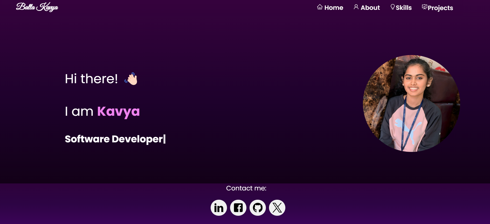
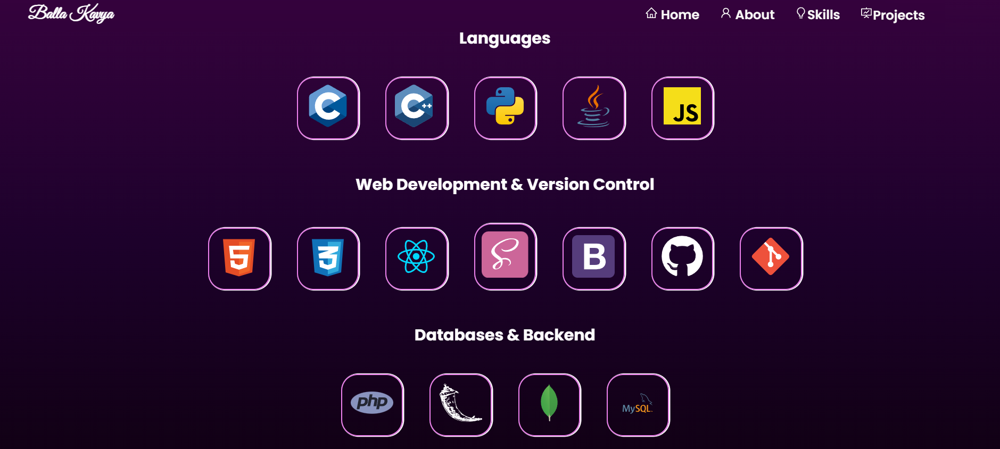

# Portfolio



## Table of Contents

- [About](#about)
- [Demo](#demo)
- [Screenshot](#screenshot)
- [Technologies Used](#technologies-used)
- [Getting Started](#getting-started)
- [Deployment](#deployment)
- [License](#license)

## About

My ReactJS portfolio is a reflection of my journey as a developer, showcasing my passion for crafting beautiful and functional web applications. With a clean and modern design, it provides visitors with an insight into my skills, experiences, and projects. Whether you're an employer, colleague, or fellow developer, this portfolio offers a glimpse into my expertise and the projects I'm proud to have worked on.

## Demo

You can explore the live demo of my portfolio here: [Live Demo](https://ballakavya.vercel.app/)

## Screenshot



## Technologies Used

Here are the technologies and frameworks I used to build my portfolio:

- VSCode
- ReactJS
- Node.js
- HTML/CSS
- Bootstrap
- Vercel

## Getting Started

To set up the project locally for development, follow these steps:

1. Clone the repository:
   ```
   git clone https://github.com/kavyaballa1020/React-Portfolio.git
   ```
2. Install dependencies:
   ```
   cd React-Portfolio
   npm install
   ```
3. Start the development server:
   ```
   npm start
   ```

4. Open your browser and go to `http://localhost:3000`.

## Deployment

I deployed my portfolio using Vercel. The deployment process with Vercel is straightforward:

1. Sign up for an account on [Vercel](https://vercel.com/).
2. Install Vercel CLI globally: `npm install -g vercel`.
3. Navigate to your project directory in the terminal.
4. Run `vercel login` and follow the authentication process.
5. Run `vercel --prod` and follow the prompts to deploy your project.

Once deployed, Vercel provides you with a unique URL where your portfolio is accessible.


## License

This project is licensed under the MIT License - see the [LICENSE](LICENSE) file for details.
